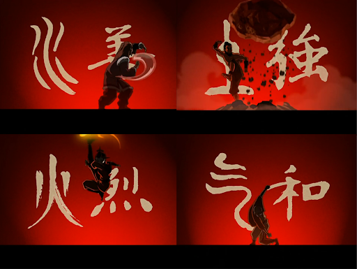

# Pengantar Frontend **Developer**

- [Pengantar Frontend **Developer**](#pengantar-frontend-developer)
  - [Kenapa harus memilih frontend?](#kenapa-harus-memilih-frontend)
  - [Apa aja sih peluang karir di frontend ?](#apa-aja-sih-peluang-karir-di-frontend-)
    - [Melihat karir alumni dan mahasiswa ITS di bidang Frontend](#melihat-karir-alumni-dan-mahasiswa-its-di-bidang-frontend)
    - [Apa aja sih yang harus dikuasai oleh seorang frontend **developer**?](#apa-aja-sih-yang-harus-dikuasai-oleh-seorang-frontend-developer)
    - [Apakah akan terus belajar Frontend ?](#apakah-akan-terus-belajar-frontend-)
  - [Paradigma Frontend Developer](#paradigma-frontend-developer)
    - [Procedural Programing](#procedural-programing)
    - [Karakteristik Utama](#karakteristik-utama)
      - [Modularity](#modularity)
      - [Function Call](#function-call)
      - [Global Variable](#global-variable)
      - [Sequential Execution](#sequential-execution)
      - [Limited Reusability](#limited-reusability)
    - [Contoh Kode Program Procedural](#contoh-kode-program-procedural)

## Kenapa harus memilih frontend?


Mengapa kita harus memilih *Frontend Development* sebagai batu loncatan karir kita? Pertama-tama, Frontend adalah jendela pertama yang terbuka bagi pengguna saat berinteraksi dengan suatu platform digital. Tampilan yang menarik, responsif, dan mudah dinavigasi merupakan kunci kesuksesan sebuah aplikasi atau website. Dengan menjadi seorang **Frontend Developer**, kita memiliki kekuatan untuk membawa ide-ide dan konsep-konsep menjadi kenyataan yang dapat dirasakan oleh jutaan pengguna di seluruh dunia.

Namun, tak hanya sekadar mempercantik tampilan, menjadi seorang *Frontend **Developer** juga membuka pintu kepada bonus-bonus menarik yang dapat menghiasi langkah karir Kita. Pertama-tama, Kita akan menjadi arsitek utama dari pengalaman pengguna (User Interface), memahami kebutuhan dan preferensi mereka, sehingga mampu menciptakan antarmuka yang intuitif dan ramah pengguna. Keahlian ini tidak hanya membuat Anda menjadi **developer** yang dicari, tetapi juga membuka peluang untuk terlibat dalam proyek-proyek menarik di berbagai industri. Dan hal ini AI belum bisa menggantikan ya tentunya hehehe…

Kemampuan untuk menguasai teknologi-teknologi terkini dalam dunia Frontend juga memberikan Anda keunggulan kompetitif. Dengan cepatnya perkembangan teknologi, menjadi seorang Frontend **Developer** berarti Anda akan terus berkembang, belajar hal-hal baru, dan tetap relevan di era digital yang selalu berubah. Ini bukan hanya sekadar karir, tetapi juga perjalanan panjang dalam eksplorasi kreativitas dan inovasi.

## Apa aja sih peluang karir di frontend ?

Banyak gak sih dari kita yang sering bertanya-tanya apa sih kelanjutan karir dari seorang frontend **developer**?

Jadi dilansir dari website [NetGuru](https://www.netguru.com/career/paths/frontend) terdapat 4 tahapan karir dalam frontend **developer** yaitu:

- Junior Frontend **Developer**
- Frontend **Developer**
- Senior Frontend **Developer**
- Frontend Software Architect

Lalu bagaimana sih dengan lulusan para Frontend **developer** di Informatika ITS ini apakah mereka bisa hidup dengan nyaman dengan di frontend ini ?

### Melihat karir alumni dan mahasiswa ITS di bidang Frontend

Siapa aja sih yang sudah sukses di bidang frontend ini? Berikut adalah beberapa alumni dan mahasiswa Informatika ITS yang sudah sukses di bidang frontend:

Muhammad Rizqi Tsani : Frontend **Developer** di [PT. Telkom Indonesia](https://www.linkedin.com/in/muhammad-rizqi-tsani-3b3b3b1a3/)

Dan banyak lagi lainya, jadi jangan ragu untuk memilih frontend sebagai karir kalian nanti.

### Apa aja sih yang harus dikuasai oleh seorang frontend **developer**?

Seorang frontend **developer** harus menguasai beberapa hal berikut ini:

- HTML
- CSS
- JavaScript
- Framework (React, Angular, Vue, dll)
- Version Control (Git)

Yang tentunya teman-teman sudah belajar di matakuliah Pemrograman Web.

### Apakah akan terus belajar Frontend ?

Mungkin hal tersebut yang telah membayangi kami dan teman - teman semua, tetapi ketika kalian sudah mengenal yang namanya Konsep “T Shaped **Developer**”


T-Shaped **Developer** mengacu pada konsep seorang pengembang yang memiliki keahlian utama yang luas (T horizontal) dan keahlian mendalam pada satu area khusus (garis vertikal pada huruf T).

Secara mudah dipahami, bayangkan T sebagai representasi kemampuan seorang pengembang. Garis horizontal melambangkan pemahaman dasar atau pengetahuan luas di berbagai aspek pengembangan, seperti Frontend, Backend, database, dan pengelolaan proyek. Sementara itu, garis vertikal menunjukkan keahlian mendalam atau spesialisasi di satu area tertentu, seperti pengembangan Frontend dengan keahlian khusus dalam framework tertentu.

Apakah hanya ada konsep itu mas admin?


Tentu tidak karena disini Ada I, T, N dan M. tetapi untuk kalangan baru memulai maka kita bisa tetapkan target kita di T terlebih dahulu. setelah bisa menguasai hal tersebut bisa terus lanjut ke N dan seterusnya sampai menjadi A. Apa itu A? A adalah Avatar.



## Paradigma Frontend Developer

Sesuai yang dijelaskan diatas bahwasanya frontend adalah sebuah “jendela pertama yang terbuka bagi pengguna saat berinteraksi dengan suatu platform digital.” Maka dalam sub bab kali ini kita akan membahas bagaimana cara mengorganisir kode secara baik dengan mengenal 3 konsep utama kita yaitu: “Prosedural Pemrograman”, “Object Oriented Programing”, “Functional Programing”

### Procedural Programing


Procedural Programing dapat didefinisikan sebagai rutinitas, subrutin, atau sebuah fungsi yang secara sederhana terdiri dari serangkaian langkah komputasi yang harus dilakukan.  Setiap fungsi mewakili tugas atau tindakan spesifik yang perlu dilakukan oleh program. Fokus utama pemrograman prosedural adalah memecah logika program menjadi komponen-komponen yang dapat dikelola, dapat digunakan kembali, dan modular.

### Karakteristik Utama

Karakteristik utama dari pemrograman prosedural meliputi:

#### Modularity

Kode program dipecah menjadi fungsi atau prosedur yang lebih kecil dan masing masing bertanggung jawab untuk tugas tertentu

#### Function Call

Prosedur atau fungsi dapat dipanggil secara berurutan. Dan sering kali fungsi mengambil sebuah parameter input dan dikembalikan sebagai hasil output

#### Global Variable

Program prosedural sering menggunakan variabel global untuk menyimpan data yang dapat diakses oleh beberapa fungsi. Namun, penggunaan variabel global yang berlebihan dapat menyebabkan masalah seperti efek samping yang tidak diinginkan dan kesulitan dalam memahami aliran data.

#### Sequential Execution

Kode program dieksekusi dalam urutan linier. Pernyataan dieksekusi satu demi satu, dan struktur kontrol seperti loop dan kondisional menentukan aliran eksekusi.

#### Limited Reusability

Penggunaan Ulang Terbatas: Meskipun fungsi meningkatkan penggunaan ulang dibandingkan dengan kode monolitik, fungsi biasanya terbatas untuk digunakan dalam program yang sama. Fungsi tidak dienkapsulasi dan dapat digunakan kembali seperti kelas dan objek dalam pemrograman berorientasi objek.

### Contoh Kode Program Procedural

```javascript
function calculateArea(length, width) {
  return length * width;
}

function calculateVolume(length, width, height) {
  return length * width * height;
}

let area = calculateArea(10, 20);
let volume = calculateVolume(10, 20, 30);
```

Dari contoh kode diatas kita dapat melihat bahwa kode tersebut terdiri dari beberapa fungsi yang masing masing bertanggung jawab untuk tugas tertentu. Fungsi `calculateArea` bertugas untuk menghitung luas, sedangkan fungsi `calculateVolume` bertugas untuk menghitung volume. Kedua fungsi tersebut dapat dipanggil secara berurutan dan masing masing fungsi mengambil parameter input dan mengembalikan hasil output.