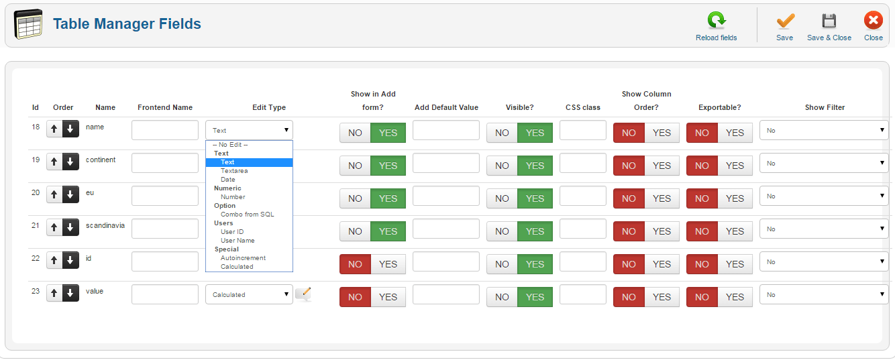

# Modul 2 - Mendalami Frontend

## Review Materi 1

## Apa yang akan dipelajari?

1. Library Lanjutan
2. State Management
3. Pengantar Framework
4. SEO

## Library


Sesuai dengan materi sebelumnya, kita telah mempelajari beberapa library yang digunakan dalam pengembangan aplikasi web. Pada materi ini, kita akan mempelajari beberapa library lanjutan yang digunakan dalam pengembangan aplikasi web.

1. Tanstack
2. React Hook Form


### Tanctack


Tanstack adalah *open source* yang berfokus pada pengembangan aplikasi web. Tanstack memiliki beberapa library yang digunakan dalam pengembangan aplikasi web, diantaranya:

1. [Tanstack Query](https://tanstack.com/query/latest)
2. [Tanstack Table](https://tanstack.com/table/latest)
3. [Tanstack Form](https://tanstack.com/form/latest)

dan masih banyak lagi, yang dapat dilihat di [sini](https://tanstack.com/)

#### Penggunaan Tanstack Query

TanStack Query adalah sebuah library JavaScript yang digunakan untuk membuat query bahasa pemrograman dengan cara yang lebih deklaratif dan mudah dipahami. Library ini memiliki beberapa kegunaan yang dapat mempermudah pengembangan aplikasi web. Berikut adalah beberapa kegunaan dari library TanStack Query:

1. Deklaratif dan Mudah Dipahami:
  TanStack Query memungkinkan pengembang untuk menulis query dengan cara yang lebih deklaratif, sehingga kode menjadi lebih mudah dipahami dan dikelola.

2. Pengelolaan State yang Efisien:
  Library ini membantu dalam pengelolaan state aplikasi dengan menyediakan cara yang efisien untuk mengambil dan menyimpan data. Hal ini dapat meningkatkan kinerja aplikasi dan mengurangi kompleksitas kode.

3. Optimalisasi Query:
  TanStack Query memungkinkan pengoptimalan query, sehingga hanya data yang diperlukan yang diambil dari server. Ini dapat mengurangi beban jaringan dan mempercepat waktu respon aplikasi.

4. Integrasi Dengan Berbagai Backend:
  Dengan TanStack Query, pengembang dapat dengan mudah mengintegrasikan aplikasi dengan berbagai backend dan sumber data, termasuk REST API, GraphQL, dan banyak lagi.

5. Type Safety:
  Library ini mendukung type safety, sehingga kesalahan tipe dapat terdeteksi lebih awal dalam proses pengembangan. Ini membantu mencegah kesalahan yang umum terkait dengan tipe data.

Dengan kombinasi fitur-fitur di atas, TanStack Query membantu pengembang dalam membuat aplikasi web yang efisien, mudah dipahami, dan dapat diintegrasikan dengan berbagai sumber data.

Mari kita lihat contoh penggunaan TanStack Query:

##### UseQuery

```typescript

 const { isPending, error, data, isFetching } = useQuery({
    queryKey: ['repoData'],
    queryFn: () =>
      axios
        .get('https://api.github.com/repos/tannerlinsley/react-query')
        .then((res) => res.data),
  })

  if (isPending) return 'Loading...'

  if (error) return 'An error has occurred: ' + error.message
```

- `useQuery` adalah *hook* yang digunakan untuk melakukan *query* ke *server*.
- `queryKey` adalah *key* yang digunakan untuk mengidentifikasi *query*.
- `queryFn` adalah *function* yang digunakan untuk melakukan *query* ke *server*.

Apabila kita tulis kode di tanpa menggunakan `useQuery`, maka kita harus melakukan *caching* secara manual.

```typescript
const [data, setData] = useState(null)
const [error, setError] = useState(null)

const fetchData = async () => {
  try {
    const res = await axios.get('https://api.github.com/repos/tannerlinsley/react-query')
    setData(res.data)
  } catch (err) {
    setError(err)
  }
}

useEffect(() => {
  fetchData()
}, [])
```

Dari contoh di atas, kita dapat melihat bahwa penggunaan `useQuery` lebih mudah dan efisien dibandingkan dengan melakukan *caching* secara manual. Dengan menggunakan `useQuery`, kita dapat mengelola *state* dengan lebih baik dan mengoptimalkan *query* ke *server*.

Kelebihihan lain apabila kita menggunakan Tanstack Query adalah di bagian `const { isPending, error, data, isFetching } = useQuery`. Kita bisa menggunakan banyak *hooks* yang disediakan oleh Tanstack Query. Antara lain:

```typescript
data,
dataUpdatedAt,
error,
errorUpdatedAt,
failureCount,
failureReason,
fetchStatus,
isError,
isFetched,
isFetchedAfterMount,
isFetching,
isInitialLoading,
isLoading,
isLoadingError,
isPaused,
isPending,
isPlaceholderData,
isRefetchError,
isRefetching,
isStale,
isSuccess,
refetch,
status,
```

Yang dokumentasinya bisa dilihat di [sini](https://tanstack.com/query/latest/docs/framework/react/reference/useQuery)

Apabila ingin mencoba langsung bisa ke [sini](https://codesandbox.io/p/devbox/goofy-field-lskn7u?file=%2Fsrc%2Findex.jsx%3A31%2C3-33%2C62)

#### UseMutation 

```typescript
const { mutateAsync, isLoading, isSuccess, isError } = useMutation(
    () =>
      fetch("https://jsonplaceholder.typicode.com/todos", {
        method: "POST",
        headers: {
          "Content-type": "application/json; charset=UTF-8",
        },
        body: JSON.stringify({
          userId: 1,
          title: todo,
          completed: false,
        }),
      }).then((res) => res.json()),
    {
      onSuccess(data) {
        console.log("Succesful", { data });
      },
      onError(error) {
        console.log("Failed", { error });
      },
      onSettled() {
        console.log("Mutation completed.");
      },
    }
  );
```

- `useMutation` adalah *hook* yang digunakan untuk melakukan *mutation* ke *server*.
- `onSuccess` adalah *function* yang akan dijalankan apabila *mutation* berhasil.
- `onError` adalah *function* yang akan dijalankan apabila *mutation* gagal.
- `onSettled` adalah *function* yang akan dijalankan apabila *mutation* selesai.
- `mutation` adalah *object* yang berisi *state* dari *mutation*.

Apabila kita tulis kode di tanpa menggunakan `useMutation`, maka kita harus melakukan *mutation* secara manual.

```typescript
const [data, setData] = useState(null)
const [error, setError] = useState(null)
const [isLoading, setIsLoading] = useState(false)


const fetchData = async () => {
  setIsLoading(true)
  try {
    const res = await axios.post('https://jsonplaceholder.typicode.com/todos', {
      userId: 1,
      title: todo,
      completed: false
    })
    setData(res.data)
  } catch (err) {
    setError(err)
  }
  setIsLoading(false)
}
```

Dari contoh di atas, kita dapat melihat bahwa penggunaan `useMutation` lebih mudah dan efisien dibandingkan dengan melakukan *mutation* secara manual. Dengan menggunakan `useMutation`, kita dapat mengelola *state* dengan lebih baik dan mengoptimalkan *mutation* ke *server*.

Contoh penggunaan `useMutation` bisa dilihat di [sini](https://codesandbox.io/p/sandbox/usemutation-demo-forked-2jc56n)

#### Optimalisasi Query dengan Tanstack Query

Untuk melihat bagaimana Tanstack Query mengoptimalkan query, kita bisa contoh artiker berikut: 

- [Inside React Query](https://tkdodo.eu/blog/inside-react-query)

### Tanstack Table



Table adalah sebuah komponen yang terkadang menyulitkan dalam pengembangan aplikasi web. Tanstack Table adalah sebuah library yang digunakan untuk membuat table dengan cara yang lebih deklaratif dan mudah dipahami. Library ini memiliki beberapa kegunaan yang dapat mempermudah pengembangan aplikasi web. Berikut adalah beberapa kegunaan dari library Tanstack Table:

[Tanstack Table](https://codesandbox.io/p/devbox/github/tanstack/table/tree/main/examples/react/basic?embed=1&theme=dark)

- Filter dan Sorting
- Pagination
- Custom Cell
- Custom Header
- Custom Footer
- Custom Row

## React Hook Form


> Performant, flexible and extensible forms with easy-to-use validation.

React Hook Form adalah library yang digunakan untuk membuat form dengan cara yang lebih deklaratif dan mudah dipahami. Library ini memiliki beberapa kegunaan yang dapat mempermudah pengembangan aplikasi web. Berikut adalah beberapa kegunaan dari library React Hook Form:

1. Performant:
  React Hook Form dirancang untuk performa yang tinggi. Library ini memungkinkan pengembang untuk membuat form dengan cara yang efisien, sehingga aplikasi dapat berjalan dengan cepat dan responsif.
2. Flexible:
  Library ini memiliki banyak fitur yang dapat disesuaikan dengan kebutuhan pengembang. Pengembang dapat mengatur form sesuai dengan kebutuhan aplikasi, sehingga form dapat berfungsi dengan baik dan sesuai dengan harapan.
3. Extensible:
  React Hook Form memiliki banyak fitur yang dapat diperluas. Pengembang dapat menambahkan fitur-fitur tambahan ke form sesuai dengan kebutuhan aplikasi, sehingga form dapat berfungsi dengan lebih baik dan sesuai dengan harapan.
  Contoh : `Controller`, `useForm`, `useFieldArray`, `useWatch`, `useFormState`, `useFormContext`, `useController`, `useFieldArray`, `useWatch`, `useFormState`, `useFormContext`, `useController`
4. Easy-to-use Validation:
  Library ini menyediakan cara yang mudah untuk melakukan validasi form. Pengembang dapat menentukan aturan validasi form dengan mudah, sehingga form dapat berfungsi dengan baik dan sesuai dengan harapan.
5. Integrasi Dengan Berbagai Backend:
  Dengan React Hook Form, pengembang dapat dengan mudah mengintegrasikan form dengan berbagai backend dan sumber data, termasuk REST API, GraphQL, dan banyak lagi.


### Penggunaan React Hook Form

```typescript
import React from "react";
import { useForm } from "react-hook-form";

export default function App() {
  const { register, handleSubmit, watch, formState: { errors } } = useForm();
  const onSubmit = data => console.log(data);

  console.log(watch("example")); // watch input value by passing the name of it

  return (
    <form onSubmit={handleSubmit(onSubmit)}>
      <input {...register("example")} />
      <input {...register("exampleRequired", { required: true })} />
      {errors.exampleRequired && <span>This field is required</span>}
      <input type="submit" />
    </form>
  );
}
```

Kode di atas adalah contoh penggunaan React Hook Form. Dari kode di atas, kita belum bisa melihat kelebihan dari React Hook Form. Namun, apabila kita menggunakan form yang lebih kompleks, maka kita bisa melihat kelebihan dari React Hook Form.

Contoh penggunaan React Hook Form bisa dilihat di [sini](https://codesandbox.io/p/sandbox/react-hook-form-other-inputs-initial-values-t38s9v?file=%2Fsrc%2FApp.js)

Untuk membuat sebuah component input yang menggunakan React Hook Form, kita bisa menggunakan `useForm` dan `useFieldArray` untuk membuat form yang lebih kompleks.

File : Input.tsx

```typescript
import React from "react";
import {useFormContext} from "react-hook-form";

export default function Input({ name, label, ...rest }) {

  const methods = useFormContext();

  const { register } = methods;

  return (
    <div>
      <label htmlFor={name}>{label}</label>
      <input id={name} {...register(name)} {...rest} />
    </div>
  );
}
```

Kemudian kita bisa menggunakan component `Input` di file `App.tsx`

```typescript
import React from "react";

import { useForm, FormProvider } from "react-hook-form";

import Input from "./Input";

export default function App() {
  const methods = useForm();

  const { handleSubmit } = methods;

  const onSubmit = (data) => {
    console.log(data);
  };

  return (
    <FormProvider {...methods}>
      <form onSubmit={handleSubmit(onSubmit)}>
        <Input name="firstName" label="First Name" />
        <Input name="lastName" label="Last Name" />
        <button type="submit">Submit</button>
      </form>
    </FormProvider>
  );
}
```

Dari contoh di atas, kita bisa melihat bahwa kita bisa membuat form yang jauh lebih sederhana dan mudah dipahami dengan menggunakan React Hook Form.

## State Management


Inti dari pengembangan aplikasi web adalah pengelolaan state. State Management adalah proses pengelolaan state dalam aplikasi web. State Management memiliki beberapa kegunaan yang dapat mempermudah pengembangan aplikasi web. Ada beberapa cara untuk melakukan state management dalam aplikasi web, diantaranya:

1. Context API - React
2. Redux
3. Zustand

### Perbandingan Context API, Redux, dan Zustand

| Fitur                | Context API                                    | Redux                                                         | Zustand                                       |   |
|----------------------|------------------------------------------------|---------------------------------------------------------------|-----------------------------------------------|---|
| Kemudahan Penggunaan | Mudah digunakan, terutama untuk aplikasi kecil | Lebih kompleks, membutuhkan waktu belajar                     | Sederhana dan mudah dipahami, mirip Redux     |   |
| Skalabilitas         | Kurang skalabel untuk aplikasi besar           | Sangat skalabel untuk aplikasi besar                          | Cukup skalabel untuk aplikasi menengah        |   |
| Performa             | Cukup performant                               | Performant                                                    | Sangat performant                             |   |
| Fitur                | Fitur bawaan terbatas                          | Fitur lengkap, termasuk middleware, devtools, dan time travel | Fitur inti state management, tanpa middleware |   |
| Boilerplate          | Sedikit boilerplate                            | Banyak boilerplate                                            | Sedikit boilerplate                           |   |
| Komunitas            | Komunitas besar dan aktif                      | Komunitas besar dan aktif                                     | Komunitas sedang berkembang                   |   |

- Context API: Cocok untuk aplikasi kecil dan sederhana.
- Redux: Cocok untuk aplikasi besar dan kompleks yang membutuhkan skalabilitas dan fitur lengkap.
- Zustand: Cocok untuk aplikasi menengah yang menginginkan performa dan kemudahan penggunaan.

Dari perbandingan di atas, kita bisa melihat bahwa masing-masing state management memiliki kelebihan dan kekurangan. Karena project kita ada di skala menengah, maka kita akan menggunakan Zustand. 

### Penggunaan Zustand

```typescript
import create from "zustand";

type State = {
  count: number;
  increment: () => void;
  decrement: () => void;
};

export const useStore = create<State>((set) => ({
  count: 0,
  increment: () => set((state) => ({ count: state.count + 1 })),
  decrement: () => set((state) => ({ count: state.count - 1 })),
}));
```

Dari contoh di atas, kita bisa melihat bahwa penggunaan Zustand sangat mudah dan efisien. Dengan menggunakan Zustand, kita bisa membuat state management yang performant dan mudah dipahami.

Bagaiaman cara memanggil `useStore` di component lain? 

```typescript
import { useStore } from "./store";

export default function Counter() {
  const { count, increment, decrement } = useStore();

  return (
    <div>
      <h1>{count}</h1>
      <button onClick={increment}>Increment</button>
      <button onClick={decrement}>Decrement</button>
    </div>
  );
}
```

Bagaimana tampilan apabila kita menggunakan React Context API? 

```typescript
import React, { createContext, useContext, useReducer } from "react";

const initialState = { count: 0 };

const reducer = (state, action) => {
  switch (action.type) {
    case "increment":
      return { count: state.count + 1 };
    case "decrement":
      return { count: state.count - 1 };
    default:
      throw new Error();
  }
};

const CounterContext = createContext();

export const useCounter = () => {
  const context = useContext(CounterContext);
  if (!context) {
    throw new Error("useCounter must be used within a CounterProvider");
  }
  return context;
};

export const CounterProvider = ({ children }) => {
  const [state, dispatch] = useReducer(reducer, initialState);
  return (
    <CounterContext.Provider value={{ state, dispatch }}>
      {children}
    </CounterContext.Provider>
  );
};

export default function Counter() {
  const { state, dispatch } = useCounter();

  return (
    <div>
      <h1>{state.count}</h1>
      <button onClick={() => dispatch({ type: "increment" })}>Increment</button>
      <button onClick={() => dispatch({ type: "decrement" })}>Decrement</button>
    </div>
  );
}
```

Dari contoh di atas, kita bisa melihat bahwa penggunaan Zustand jauh lebih mudah dan efisien dibandingkan dengan penggunaan React Context API. Dengan menggunakan Zustand, kita bisa membuat state management yang performant dan mudah dipahami.

### Loadash

Penjelasan mengenai Lodash

Lodash adalah pustaka JavaScript yang menyediakan fungsi utilitas untuk tugas pemrograman umum menggunakan paradigma pemrograman fungsional. Pustaka ini membantu programmer menulis JavaScript yang lebih ringkas dan mudah dipelihara.

Fitur utama Lodash:

- Utilitas: Menyederhanakan tugas pemrograman umum seperti menentukan jenis data dan operasi matematika.
- Koleksi: Menyediakan fungsi untuk bekerja dengan array, objek, dan string.
- Fungsi: Menyediakan fungsi untuk operasi umum seperti pemfilteran, pemetaan, dan pengurangan.
- Pemrograman fungsional: Mendukung paradigma pemrograman fungsional dengan menyediakan fungsi-fungsi yang murni dan tidak mengubah data.

Manfaat menggunakan Lodash:

- Meningkatkan kode: Kode Anda akan lebih ringkas, mudah dibaca, dan mudah dipelihara.
- Menghemat waktu: Anda tidak perlu menulis ulang kode untuk tugas-tugas umum.
- Meningkatkan skalabilitas: Kode Anda akan lebih mudah diskalakan untuk aplikasi yang lebih besar.

Beberapa contoh fungsi Lodash:

- `.find(array, predicate)`: Menemukan elemen pertama dalam array yang memenuhi predikat yang diberikan.
- `_.map(array, iteratee)`: Memetakan setiap elemen dalam array ke nilai baru.
- `_.filter(array, predicate)`: Memfilter elemen dalam array yang memenuhi predikat yang diberikan.
- `_.reduce(array, iteratee, accumulator)`: Mengurangi array menjadi nilai tunggal.

### Libaran Lainnya

- React Drag and Drop
- Immer
- auto-zustand-selectors-hook
- Dan sebagainya

## Pengantar Framework


Apa itu Framework Frontend?

Framework frontend adalah kerangka kerja perangkat lunak yang membantu pengembang web membangun antarmuka pengguna (UI) yang interaktif dan responsif. Framework ini menyediakan struktur dan komponen siap pakai yang dapat digunakan pengembang untuk mempercepat proses pengembangan dan meningkatkan kualitas kode.

Beberapa contoh framework frontend:

1. Next.js
2. Vue
3. Angular
4. Svelte
5. Ember
6. Backbone

| Fitur          | Next.js                                    | Vue                                        | Angular                                    | Svelte                             | Ember                                   | Backbone                            |
|----------------|--------------------------------------------|--------------------------------------------|--------------------------------------------|------------------------------------|-----------------------------------------|-------------------------------------|
| Tipe Framework | React Framework                            | Standalone Framework                       | Standalone Framework                       | Compiler                           | Standalone Framework                    | MVC Library                         |
| Kurva Belajar  | Sedang                                     | Mudah                                      | Sulit                                      | Mudah                              | Sedang                                  | Sedang                              |
| Skalabilitas   | Tinggi                                     | Tinggi                                     | Tinggi                                     | Tinggi                             | Sedang                                  | Rendah                              |
| Fitur bawaan   | Server-side rendering, Routing, API routes | Komponen dasar, Template, State management | Komponen, Dependency Injection, Routing    | Komponen reaktiv, Compiler         | Routing, Ember Data (ORM), Utility Belt | Model-View-Controller, Event-driven |
| Komunitas      | Besar                                      | Besar                                      | Besar                                      | Sedang                             | Kecil                                   | Kecil                               |
| Populer untuk  | Aplikasi web statis & SSR, eCommerce       | Aplikasi web interaktif, SPA               | Aplikasi web skala besar, Perusahaan besar | Performa, Aplikasi web single-page | Aplikasi web kompleks                   | Aplikasi web lama                   |

Dari perbandingan di atas, kita bisa melihat bahwa masing-masing framework memiliki kelebihan dan kekurangan. Disini kita tidak menekanakan framework mana yang terbaik, karena setiap framework memiliki kelebihan dan kekurangan masing-masing.

## SEO


Apa itu SEO?

SEO (Search Engine Optimization) adalah serangkaian teknik untuk meningkatkan visibilitas dan peringkat website di hasil pencarian mesin pencari seperti Google, Bing, dan Yahoo. Tujuannya adalah untuk menarik lebih banyak traffic organik ke website Anda.

Bagaimana Cara Kerja SEO?

Mesin pencari menggunakan algoritma untuk menentukan peringkat website di hasil pencarian. Algoritma ini mempertimbangkan berbagai faktor, termasuk:

- Relevansi: Seberapa relevan konten website Anda dengan kata kunci yang dicari pengguna.
- Otoritas: Seberapa terpercaya dan kredibel website Anda.
- Kualitas konten: Seberapa baik dan bermanfaat konten website Anda bagi pengguna.
- Pengalaman pengguna: Seberapa mudah dan menyenangkan pengguna website Anda.

Bagaimana Meningkatkan SEO?

Ada beberapa teknik yang dapat Anda gunakan untuk meningkatkan SEO website Anda, diantaranya:

1. Keyword Research: Mencari kata kunci yang relevan dengan bisnis Anda dan menggunakannya dalam konten website Anda.
2. On-Page Optimization: Mengoptimalkan judul, meta deskripsi, dan konten website Anda untuk kata kunci yang relevan.
3. Off-Page Optimization: Membangun tautan balik (backlink) dari website lain ke website Anda.
4. Mobile Optimization: Memastikan website Anda dioptimalkan untuk perangkat mobile.
5. Site Speed: Memastikan website Anda memiliki kecepatan yang baik.
6. User Experience: Memastikan website Anda menyediakan pengalaman pengguna yang baik.
7. Content Quality: Memastikan konten website Anda berkualitas dan bermanfaat bagi pengguna.
8. Technical SEO: Memastikan website Anda dioptimalkan dari segi teknis, seperti struktur URL, sitemap, dan robots.txt.
9. Local SEO: Meningkatkan visibilitas website Anda di hasil pencarian lokal.
10. Social Media: Meningkatkan visibilitas website Anda melalui media sosial.

### Sitemap

Apa itu Sitemap?

Sitemap adalah file XML yang berisi daftar URL dari website Anda. Sitemap membantu mesin pencari menemukan dan mengindeks halaman-halaman website Anda.

Bagaimana Cara Membuat Sitemap?


Apabila teman-teman menggunakan Next.js, maka teman-teman bisa menggunakan `next-sitemap` untuk membuat sitemap. 

```typescript
// next.config.js
module.exports = {
  siteUrl: 'https://example.com',
  generateRobotsTxt: true,
  sitemapSize: 5000,
}
```

Apabila teman-teman menggunakan React, maka teman-teman bisa menggunakan `react-router-sitemap` untuk membuat sitemap.

Dan masih banyak cara lainnya untuk membuat sitemap.

### Robots.txt

Apa itu Robots.txt?

Robots.txt adalah file teks yang berisi instruksi untuk mesin pencari tentang halaman-halaman website mana yang boleh atau tidak boleh diindeks.

Bagaimana Cara Membuat Robots.txt?

Apabila teman-teman menggunakan Next.js, maka teman-teman bisa melihat documetasi [next-robots](https://nextjs.org/docs/app/api-reference/file-conventions/metadata/robots)


### Open Graph


Apa itu Open Graph?

Open Graph adalah protokol yang digunakan untuk menambahkan metadata ke halaman website Anda. Metadata ini membantu mesin pencari dan media sosial memahami konten website Anda.

Selain itu, Open Graph juga membantu website Anda terlihat lebih menarik di hasil pencarian dan media sosial.

Dokumentasi Open Graph bisa dilihat di [sini](https://ogp.me/)


## Tugas

### Deskripsi

Dzikri berhasil menyelesaikan tugasnya dalam membuat platform **Project Management Board**. Namun, setelah meninjau hasilnya, ia merasa kode programnya terlihat berantakan dan tidak terstruktur dengan baik. Dzikri juga menyadari bahwa penggunaan *library-library* yang tersedia di internet dapat membantu membuat kodenya menjadi lebih efektif.

Dengan mendengar kabar bahwa waktu abmas telah diundur, Dzikri melihat ini sebagai kesempatan untuk melakukan perbaikan pada platform tersebut. Dzikri mengambil langkah-langkah untuk memperbaiki kode, seperti membagi kode menjadi modul-modul yang lebih kecil, melakukan *refactoring* pada bagian-bagian kompleks, dan meningkatkan dokumentasi. Dengan ketentuan tugas yang lebih lengkap adalah sebagai berikut:

0. ⁠Memperbaiki dan menyelesaikan tugas kode yang sebelumnya
1. Merapikan kode sebelumnya menggunakan *framework* dan memperbaiki tampilan agar lebih menarik
2. ⁠⁠Memanfaatkan *library* dan menerapkan 1 fitur yang menarik dari *library* tersebut
3. Mengutilisasi SEO semaksimal mungkin
4. ⁠Mengimplementasikan autentikasi (*Login/Register*)

### Pengumpulan
https://forms.gle/twFMHimNpEmyqZmeA

